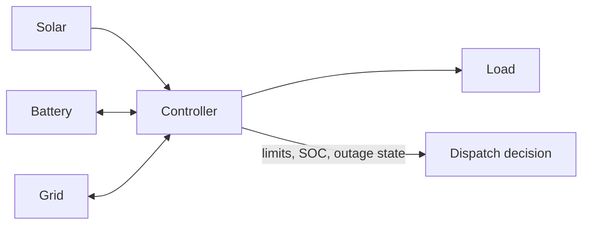

# Microgrid Controller Simulation

[](https://github.com/Mini34/microgrid-controller-sim/actions/workflows/test.yml)


A deterministic controls project for dispatching power among solar generation, a
battery, the utility grid, and a time-varying load.



## Control objectives

1. Serve the load from available solar power.
2. Charge the battery with surplus solar while respecting power and SOC limits.
3. Discharge the battery to hold grid import below a configurable peak limit.
4. During an outage, use solar and battery power before reporting unserved load.
5. Keep every interval's decision deterministic and testable.

## Run it

```powershell
python -m pip install .
microgrid-sim
microgrid-sim --steps 24
microgrid-sim --csv reports/day.csv

# The module form works without installation from the repository root.
python -m microgrid_controller.cli
python -m microgrid_controller.cli --csv reports/day.csv
python -m unittest discover -s tests -v
```

The included day profile models a morning load increase, midday solar generation, an
evening peak, and a one-hour grid outage.

## Example controller decisions

| Situation | Controller response |
| --- | --- |
| 8 kW solar, 3 kW load, 50% SOC | Serve the load and charge the battery at its 5 kW limit |
| 0 kW solar, 10 kW load, 80% SOC | Discharge 4 kW and hold grid import to 6 kW |
| 1 kW solar, 4 kW load, grid outage | Supply the remaining 3 kW from the battery |
| 0 kW solar, 10 kW load, minimum SOC | Cap grid import at 6 kW and report 4 kW unserved |

Every decision includes `balance_error_kw`; a valid dispatch reports `0.0` after
accounting for served and explicitly unserved load.

Example 24-step summary:

```json
{
  "steps": 24,
  "final_soc": 0.47632,
  "peak_grid_import_kw": 6.0,
  "unserved_energy_kwh": 3.0,
  "modes": [
    "grid_connected",
    "load_shed",
    "peak_shaving",
    "solar_charging",
    "solar_export"
  ]
}
```

## Engineering assumptions

- Power is treated as constant within each simulation interval.
- Battery charge/discharge efficiency is applied to state-of-charge updates.
- The controller enforces SOC, battery-power, and grid-import limits rather than allowing
  an impossible dispatch.
- The model reports unserved load instead of silently violating energy constraints.

## Limitations

This is a supervisory-control simulation, not inverter firmware or a protection model.
It omits voltage/frequency dynamics, reactive power, relay coordination, battery thermal
behaviour, degradation, communications delay, and certification requirements. Those
limitations are documented to keep the engineering claims precise.
